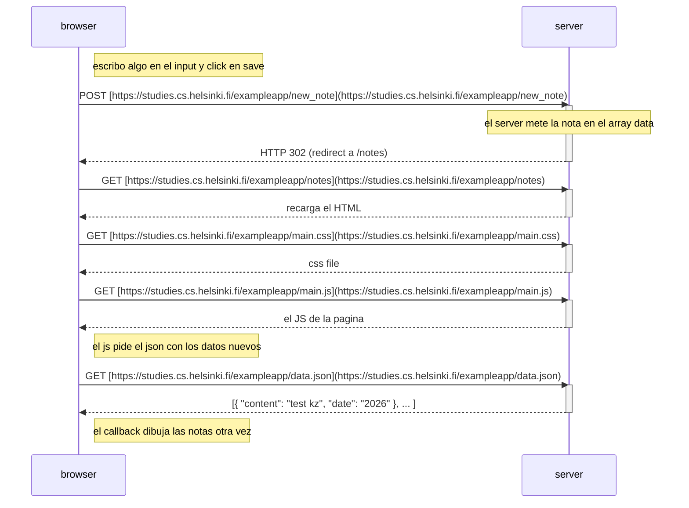
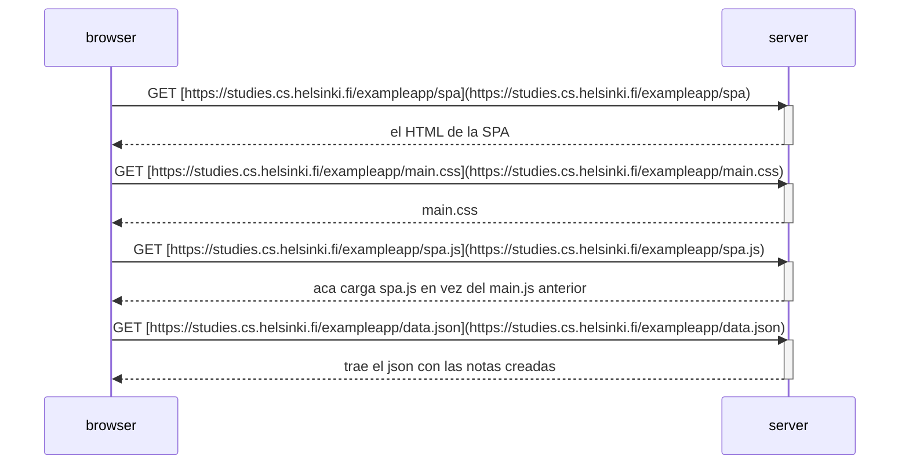

# tareas parte 0 - Karen Zamora.

## 0.4 nuevo diagrama nota



## 0.5 diagrama spa


## 0.6 nueva nota spa
    ```mermaid
    sequenceDiagram
    participant browser
    participant server

    Note right of browser: click en save (el js atrapa el evento)
    Note right of browser: la SPA agrega la nota a la lista en pantalla sin recargar todo

    browser->>server: POST [https://studies.cs.helsinki.fi/exampleapp/new_note_spa](https://studies.cs.helsinki.fi/exampleapp/new_note_spa)
    activate server
    Note over server: guarda el json de la nota nueva
    server-->>browser: HTTP 201 created
    deactivate server
    ```